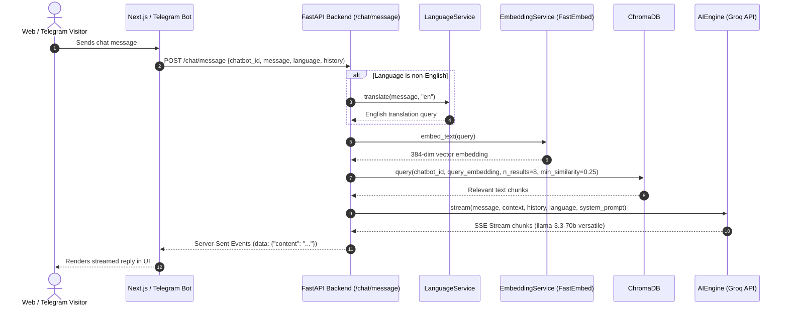
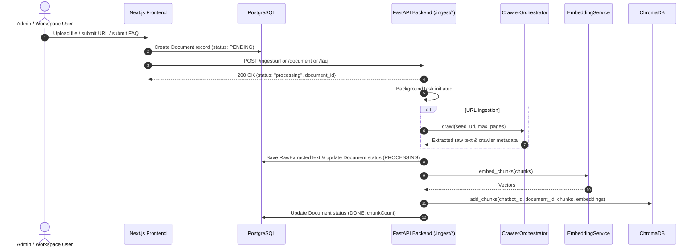
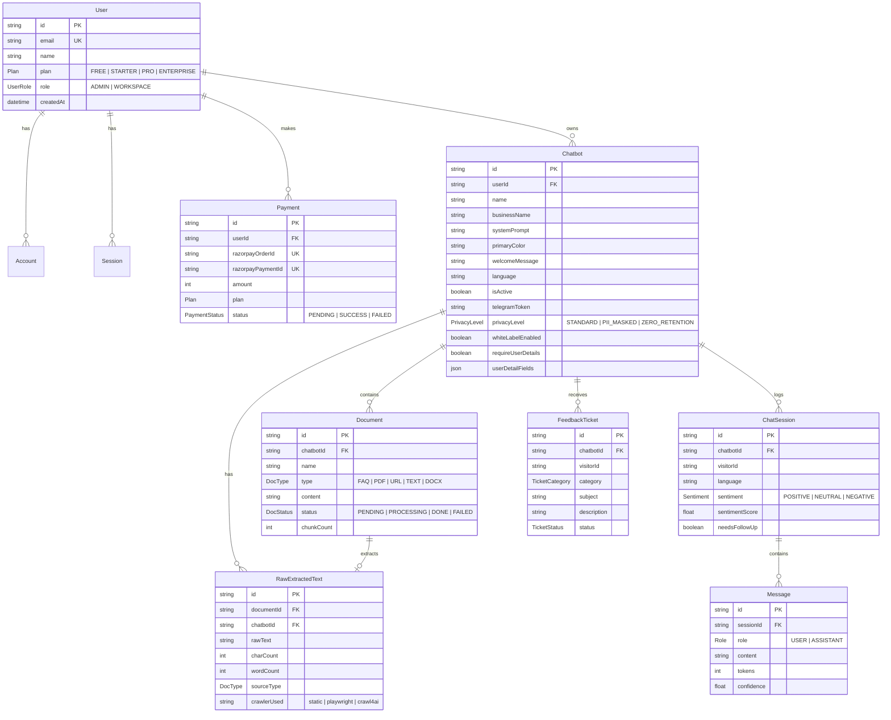

# AI Customer Support Assistant — Full Stack Project Overview

This document provides a comprehensive technical overview of the **AI Customer Support Assistant** (codenamed **Conciergo** / **SupportIQ**), based strictly on the current implementation in the codebase.

---

## 1. Project Summary

The **AI Customer Support Assistant** is a multi-tenant, Retrieval-Augmented Generation (RAG) platform designed to automate web-based and messaging-based customer support. It enables businesses to ingest domain-specific knowledge (websites, FAQs, PDFs, Word documents, text files) into isolated AI chatbots that can be embedded into websites or connected directly to messaging platforms such as Telegram.

### Problem Solved
- Eliminates AI "hallucinations" by enforcing strict zero-hallucination context grounding.
- Reduces support desk workload by providing instantaneous, multi-lingual answers 24/7.
- Simplifies knowledge management with dynamic website crawlers capable of parsing both static and single-page application (SPA) websites.
- Provides actionable support analytics via natural-language-to-SQL (NL2SQL) querying over database sessions and visitor interactions.

### Target Users
- **Businesses & SaaS Companies**: Needing an embeddable, customizable support bot with white-label capabilities.
- **Support Teams & Admins**: Managing knowledge bases, triaging feedback tickets, and analyzing visitor interactions.
- **End-Users / Web Visitors**: Receiving automated support in their native language across web and messaging channels.

---

## 2. Core Features

Only features fully implemented in code are listed below:

1. **RAG-Powered Zero-Hallucination Chat Engine**
   - Answers questions strictly using retrieved knowledge context.
   - Enforces fallback responses when relevant information is absent.
   - Utilizes FastEmbed for vector embeddings (`sentence-transformers/all-MiniLM-L6-v2`) and ChromaDB vector search with cosine similarity filtering (`min_similarity=0.25`).
   - Powered by Groq API (`llama-3.3-70b-versatile` by default with fallback models).

2. **Multi-Engine Website & Document Ingestion**
   - **File Uploads**: Processes PDF (`PyMuPDF`), DOCX (`python-docx`), and plain text files.
   - **FAQ Ingestion**: Direct pair ingestion (`Q: ... A: ...`).
   - **Hybrid Web Crawler Orchestrator**: Automatically probes target URLs to select the best scraper:
     - `StaticCrawler`: Fast HTTP GET parsing with `httpx` and `BeautifulSoup4`.
     - `CrawleePlaywrightScraper`: Headless Chromium rendering via `crawlee` & `playwright` for Client-Side Rendered (CSR) SPAs (React, Next.js, Vue).
     - `Crawl4AICrawler`: Markdown-optimized extraction for documentation sites (`/docs`, `/wiki`, GitBook).
   - Saves raw text extractions to PostgreSQL (`RawExtractedText`) alongside vector chunking.

3. **Multi-Channel Delivery**
   - **Web Embed Widget**: Light-weight, standalone React/Vite iframe widget (`widget.js`) with custom primary accent color.
   - **Hosted Chat Window**: Full-screen standalone chat interface at `/chat/[botId]`.
   - **Telegram Integration**: Polling-based multi-tenant Telegram bot service using `python-telegram-bot` (`/telegram/connect`, `/telegram/disconnect`).
   - **n8n Automation Workflows**: Webhook integration for escalations, daily summary reports, CRM lead capture, and new conversation alerts.

4. **Multi-Lingual Processing & Query Translation**
   - Auto-detects user language using `langdetect`.
   - Translates non-English queries to English before vector retrieval to match knowledge base embeddings, while preserving original language response output.
   - Supports responses in English, Tamil, Hindi, Spanish, French, German, Portuguese, Chinese, Japanese, Korean, Arabic, Russian, and Italian.

5. **Natural Language Analytics (NL2SQL)**
   - Translates plain-English queries (e.g., *"How many user messages were received this week?"*) into secure PostgreSQL `SELECT` statements using Groq (`openai/gpt-oss-20b`).
   - Enforces user ownership isolation (`userId` filtering) and `SELECT`-only execution.
   - Caches query results in Redis (`REDIS_URL`) with a 5-minute TTL.

6. **Visitor Feedback & Escalation System**
   - Captures visitor feedback tickets with category tags (`INACCURATE_ANSWER`, `BUG_REPORT`, `COMPLAINT`, `FEATURE_REQUEST`, `GENERAL_FEEDBACK`).
   - Supports ticket status lifecycle (`OPEN`, `REVIEWED_BY_CLIENT`, `ESCALATED_TO_ADMIN`, `RESOLVED`, `CLOSED`) and admin responses.

7. **Pre-Chat Form & White-Labeling**
   - Supports mandatory pre-chat details collection (name, email, custom fields).
   - Paid plan white-label option to customize or hide "Powered by Conciergo" branding.

8. **Subscription & Payment Processing**
   - Razorpay payment gateway integration for plan tier upgrades (`FREE`, `STARTER`, `PRO`, `ENTERPRISE`).
   - Signature verification and webhook endpoint for payment event handling.

9. **Multi-Tenant Workspaces & Role-Based Access Control**
   - `UserRole` enums (`ADMIN`, `WORKSPACE`).
   - NextAuth.js authentication with Google OAuth and Email Magic Links.
   - Isolated ChromaDB collections per chatbot (`bot_{chatbot_id}`).

---

## 3. Tech Stack

### Frontend & Embed Widget
| Tech / Library | Version | Description |
| --- | --- | --- |
| **Next.js** | `14.2.14` | Core React framework (App Router) |
| **React** | `^18.3.1` | UI rendering library |
| **TypeScript** | `^5.6.2` | Static typing |
| **Tailwind CSS** | `^3.4.11` | Styling system |
| **Radix UI** | Various | Accessible UI primitives (Dialog, Dropdown, Tabs, Toast, etc.) |
| **Framer Motion** | `^13.1.1` | Dynamic micro-animations |
| **Recharts** | `^2.12.7` | Analytics charts |
| **Three.js / React Three Fiber** | `^0.185.1` | Particle background effects |
| **NextAuth.js** | `^4.24.8` | Authentication management |
| **Prisma ORM** | `^5.22.0` | Database ORM and migrations |
| **Razorpay SDK** | `^2.9.8` | Payment gateway integration |
| **Vite** | `^5.4.0` | Embed widget build tool (`/embed`) |

### Backend Service
| Tech / Library | Version | Description |
| --- | --- | --- |
| **Python** | `3.11+` | Backend runtime environment |
| **FastAPI** | `0.115.0` | Async web framework |
| **Uvicorn** | `>=0.34.0` | ASGI server |
| **Pydantic** | `2.9.2` | Data validation and settings management |
| **SQLAlchemy** | `2.0.35` | Async SQL ORM for Python |
| **asyncpg** | `0.29.0` | PostgreSQL async driver |
| **FastEmbed** | `0.3.6` | ONNX-optimized text embeddings (`all-MiniLM-L6-v2`) |
| **ChromaDB** | `0.5.11` | Vector storage client |
| **Groq SDK** | `>=0.11.0` | AI LLM inference client (`llama-3.3-70b-versatile`, `gpt-oss-120b`, `gpt-oss-20b`) |
| **redis** | `5.1.1` | Async Redis client for NL2SQL query caching |
| **python-telegram-bot** | `>=21.0` | Async Telegram bot polling framework |
| **Crawlee / Playwright** | `>=0.1.0` / `>=1.44.0` | Headless browser crawler |
| **Crawl4AI** | `>=0.3.74` | LLM-ready markdown crawler |
| **BeautifulSoup4 / httpx** | `4.12.3` / `0.27.2` | Static HTML parser & HTTP client |

### Infrastructure & Databases
- **PostgreSQL 15**: Primary database managed via Supabase / local Docker.
- **ChromaDB 0.5.11**: Vector store hosted via persistent volume (`/data/chroma`) or HTTP service.
- **Redis 7**: Caching layer for NL2SQL queries.
- **n8n**: Workflow automation server running on Docker (`n8nio/n8n`).

---

## 4. Architecture & Workflow

### End-to-End User Chat Flow


### Knowledge Base Ingestion Flow


---

## 5. Folder & File Structure

```text
ai-support-chatbot/
├── .agents/                    # Agent customizations and workspace skills
├── backend/                    # Python FastAPI backend core
│   ├── app/
│   │   ├── models/             # Pydantic schemas for requests and models
│   │   │   ├── analytics.py    # NL2SQL payload schemas
│   │   │   ├── chat.py         # Chat request/response schemas
│   │   │   └── document.py     # Ingestion & FAQ request schemas
│   │   ├── routers/            # FastAPI route definitions
│   │   │   ├── analytics.py    # NL2SQL query endpoint (/analytics/nl-query)
│   │   │   ├── chat.py         # Streaming (/chat/message) & JSON chat (/chat/telegram)
│   │   │   ├── embeddings.py   # Embedding chunk counters (/embeddings/status)
│   │   │   ├── health.py       # Simple and detailed health checks (/health)
│   │   │   ├── ingest.py       # Ingestion endpoints for doc, FAQ, URL
│   │   │   └── telegram.py     # Telegram bot connection manager routes
│   │   ├── services/           # Business logic & AI services
│   │   │   ├── ai_engine.py    # Groq API streaming client with fallback models
│   │   │   ├── chroma_service.py # ChromaDB client & collection vector ops
│   │   │   ├── claude_service.py # Claude API wrapper (stub/alternative provider)
│   │   │   ├── crawl4ai_crawler.py # Crawl4AI markdown scraper for documentation
│   │   │   ├── crawlee_scraper.py  # Crawlee + Playwright headless browser scraper
│   │   │   ├── crawler_orchestrator.py # Site architectural probe & crawler selector
│   │   │   ├── document_processor.py   # PDF, DOCX, TXT text extractor
│   │   │   ├── embedding_service.py   # FastEmbed ONNX embedding generator
│   │   │   ├── js_scraper.py       # Playwright JS-rendering fallback scraper
│   │   │   ├── language_service.py     # Language detection & Groq translation
│   │   │   ├── llm_service.py          # General LLM service abstraction
│   │   │   ├── nl2sql_service.py       # Groq-powered natural language to SQL converter
│   │   │   ├── rag_service.py          # Context retriever & answer generator
│   │   │   ├── telegram_bot.py         # Multi-tenant python-telegram-bot manager
│   │   │   └── url_scraper.py          # Static httpx + BeautifulSoup crawler
│   │   ├── utils/              # Helper utilities
│   │   │   ├── prompt_builder.py   # System prompt generator
│   │   │   ├── text_splitter.py    # Recursive text chunking utility
│   │   │   └── token_counter.py    # Token counter helper
│   │   ├── config.py           # Pydantic Settings instance reading from .env
│   │   └── database.py         # Async SQLAlchemy engine & session maker
│   ├── main.py                 # FastAPI app entrypoint & lifespan hooks
│   ├── requirements.txt        # Python dependency manifest
│   ├── start.ps1               # Windows PowerShell backend start script
│   └── Dockerfile              # Docker container build spec for backend
├── docs/                       # Project architecture documentation & specs
│   ├── FULL_STACK_CODEBASE_ANALYSIS.md
│   ├── PROJECT_SPECIFICATION.md
│   ├── PROJECT_OVERVIEW.md     # Full project overview documentation
│   ├── api-reference.md
│   ├── architecture.md
│   ├── embed-guide.md
│   ├── n8n-setup.md
│   └── nl2sql-examples.md
├── embed/                      # Standalone embeddable web widget
│   ├── src/
│   │   ├── ChatWidget.tsx      # Floating action button & responsive iframe widget
│   │   ├── main.tsx            # DOM mounting entrypoint (`window.ChatbotAI.init`)
│   │   └── styles.css          # Scoped CSS styles for embedded widget
│   ├── package.json            # Widget npm dependencies
│   └── vite.config.ts          # Vite build config producing single `widget.js` bundle
├── frontend/                   # Next.js 14 Web Application
│   ├── prisma/
│   │   ├── schema.prisma       # Prisma schema for PostgreSQL
│   │   └── seed.ts             # Demo data seed script
│   ├── src/
│   │   ├── app/                # Next.js App Router pages & API routes
│   │   │   ├── (auth)/         # Login and Registration routes
│   │   │   ├── (dashboard)/    # Dashboard layout and sub-pages
│   │   │   │   ├── admin/      # System admin control panel
│   │   │   │   ├── analytics/  # NL2SQL analytics interface & metrics
│   │   │   │   ├── chatbot/    # Chatbot manager & knowledge base management
│   │   │   │   ├── conversations/ # Session viewer & message transcripts
│   │   │   │   ├── dashboard/  # Overview stats dashboard
│   │   │   │   ├── feedback/   # Ticket resolution interface
│   │   │   │   ├── integrations/# Telegram & webhook configuration
│   │   │   │   └── settings/   # Profile settings & Razorpay plan management
│   │   │   ├── api/            # Next.js API routes (Auth, Chatbots, Payments, Webhooks)
│   │   │   ├── chat/           # Hosted standalone chat UI page
│   │   │   ├── layout.tsx      # Root application layout
│   │   │   └── page.tsx        # Modern landing page
│   │   ├── components/         # Reusable React UI components
│   │   │   ├── analytics/      # NL2SQL query interface components
│   │   │   ├── chatbot/        # Customization, prompt builder, embed modal
│   │   │   ├── dashboard/      # Dashboard cards and widgets
│   │   │   ├── knowledge/      # FAQ, URL, and document upload editors
│   │   │   └── ui/             # Radix UI styled primitives
│   │   ├── hooks/              # Custom React hooks
│   │   ├── lib/                # Utility modules (Prisma client, NextAuth, Razorpay)
│   │   ├── middleware.ts       # Route protection middleware checking session tokens
│   │   └── types/              # TypeScript interface definitions
│   ├── package.json            # Frontend npm dependencies
│   └── tailwind.config.ts      # Tailwind CSS configuration
├── n8n-workflows/              # Pre-configured n8n automation JSON files
│   ├── daily-report-email.json # Scheduled email summary workflow
│   ├── escalation-to-human.json# Slack/email escalation workflow
│   ├── lead-capture-crm.json   # CRM lead sync workflow
│   ├── new-conversation-alert.json # Alert workflow on chat start
│   └── telegram-bot.json       # Legacy n8n Telegram workflow
├── scripts/                    # Maintenance & helper scripts
│   ├── backup-db.sh            # PostgreSQL backup script
│   ├── generate-embed.sh       # Widget bundle build wrapper
│   └── seed-demo.py            # Python database seeder
├── docker-compose.yml          # Full multi-container Docker deployment configuration
├── docker-compose.dev.yml      # Development overrides for Docker Compose
├── Makefile                    # Standard developer automation commands
└── README.md                   # Repository overview documentation
```

---

## 6. Key Modules / Code Walkthrough

### Backend Core

#### 1. [`backend/main.py`](file:///d:/ai-support-chatbot/backend/main.py)
- **Role**: Backend application entry point.
- **Key Logic**: Initializes FastAPI with `lifespan` hook. Loads settings, checks Groq API key, initializes database connections via `init_db()`, pre-warms the FastEmbed model in a background thread to prevent cold start latency, mounts routers, and auto-starts polling Telegram bots for all active chatbots having a `telegramToken` stored in PostgreSQL.

#### 2. [`backend/app/services/rag_service.py`](file:///d:/ai-support-chatbot/backend/app/services/rag_service.py)
- **Role**: RAG orchestration engine.
- **Key Logic**: Translates non-English incoming messages to English using `LanguageService.translate()`. Generates 384-dimensional dense embeddings via `EmbeddingService`. Queries `ChromaService` for cosine similarity matches above `min_similarity=0.25`. Formats retrieved chunks into system context and streams the response chunk by chunk using `AIEngine.stream()`.

#### 3. [`backend/app/services/ai_engine.py`](file:///d:/ai-support-chatbot/backend/app/services/ai_engine.py)
- **Role**: Primary LLM streaming interface.
- **Key Logic**: Constructs a strict system prompt containing retrieved context, ground-truth directives, concise tone requirements, user system prompts, and target language instructions. Invokes Groq Async API (`llama-3.3-70b-versatile`). On rate limits (`429`), automatically falls back through a sequence of fallback models (`openai/gpt-oss-120b`, `openai/gpt-oss-20b`, `qwen/qwen3.6-27b`).

#### 4. [`backend/app/services/chroma_service.py`](file:///d:/ai-support-chatbot/backend/app/services/chroma_service.py)
- **Role**: Vector database client manager.
- **Key Logic**: Manages isolated collections named `bot_{chatbot_id}` per chatbot. Supports `HttpClient` (remote ChromaDB service), `PersistentClient` (at `/data/chroma`), and `EphemeralClient` (in-memory test fallback). Implements `add_chunks()`, `query()`, `delete_document()`, and `count_chunks()`.

#### 5. [`backend/app/services/crawler_orchestrator.py`](file:///d:/ai-support-chatbot/backend/app/services/crawler_orchestrator.py)
- **Role**: Smart website crawler dispatcher.
- **Key Logic**: Probes target URLs for SPA markers (`id="root"`, `__next_data__`, React/Vue indicators) or documentation URL patterns (`/docs`, GitBook). Dispatches jobs to `Crawl4AICrawler` (for docs), `CrawleePlaywrightScraper` (for SPAs), or `URLScraper` (static BS4). Escalates to Playwright if static crawling yields sparse content.

#### 6. [`backend/app/services/nl2sql_service.py`](file:///d:/ai-support-chatbot/backend/app/services/nl2sql_service.py)
- **Role**: Natural language to SQL query engine.
- **Key Logic**: Accepts plain-English questions and a `user_id`. Generates a single valid PostgreSQL `SELECT` query using Groq (`openai/gpt-oss-20b`) with strict schema prompt hints. Validates query safety (`SELECT` only, tenant isolation), executes query via SQLAlchemy async session, and caches results in Redis (`REDIS_URL`) for 300 seconds.

#### 7. [`backend/app/services/telegram_bot.py`](file:///d:/ai-support-chatbot/backend/app/services/telegram_bot.py)
- **Role**: Telegram bot polling manager.
- **Key Logic**: Spawns and manages `python-telegram-bot` Application instances for each chatbot with a `telegramToken`. Operates via async polling (no public webhook ports required). Handles user messages by invoking `RagService` directly in-memory and returning formatted replies.

---

### Frontend Core

#### 1. [`frontend/src/middleware.ts`](file:///d:/ai-support-chatbot/frontend/src/middleware.ts)
- **Role**: Edge route protection middleware.
- **Key Logic**: Intercepts requests to protected routes (`/dashboard`, `/admin`, `/chatbot`, `/conversations`, `/analytics`). Checks for NextAuth session cookies (`__Secure-next-auth.session-token` or `next-auth.session-token`). Redirects unauthenticated visitors to `/login?callbackUrl=...`.

#### 2. [`frontend/src/app/api/payments/create-order/route.ts`](file:///d:/ai-support-chatbot/frontend/src/app/api/payments/create-order/route.ts)
- **Role**: Razorpay checkout initialization endpoint.
- **Key Logic**: Authenticates user via NextAuth session. Accepts plan tier selection (`STARTER`, `PRO`, `ENTERPRISE`), instantiates Razorpay SDK, creates an order in paise (e.g., 49900 = ₹499.00), and records a `Payment` entity with `status: PENDING` in PostgreSQL.

---

## 7. Data Model / Database Schema

The database model is defined in [`frontend/prisma/schema.prisma`](file:///d:/ai-support-chatbot/frontend/prisma/schema.prisma) and synced to PostgreSQL.



---

## 8. APIs & Integrations

### Internal FastAPI Backend Endpoints (`http://localhost:8000`)

| Method | Endpoint | Purpose | Request Body / Parameters | Response Shape |
| --- | --- | --- | --- | --- |
| `GET` | `/health` | Basic service health check | None | `{"status": "ok", "service": "..."}` |
| `GET` | `/health/detailed` | Deep health check (DB, Chroma, Models) | None | `{"status": "ok", "database": "ok", "chromadb": "ok", "embedding_model": "ok", "env": {...}}` |
| `POST` | `/chat/message` | Stream RAG answer via Server-Sent Events | `{"chatbot_id": "...", "session_id": "...", "message": "...", "history": [], "language": "en"}` | `text/event-stream` (`data: {"content": "..."}`) |
| `POST` | `/chat/telegram` | Non-streaming JSON answer for Telegram / n8n | `{"chatbot_id": "...", "session_id": "...", "message": "..."}` | `{"reply": "...", "chatbot_id": "...", "session_id": "..."}` |
| `POST` | `/ingest/document` | Upload file (PDF/DOCX/TXT) for background ingestion | Form Data: `chatbot_id`, `document_id`, `file` | `{"status": "processing", "document_id": "..."}` |
| `POST` | `/ingest/faq` | Ingest structured FAQ pairs | `{"chatbot_id": "...", "document_id": "...", "pairs": [{"question": "...", "answer": "..."}]}` | `{"status": "processing", "document_id": "..."}` |
| `POST` | `/ingest/url` | Trigger web crawler ingestion | `{"chatbot_id": "...", "document_id": "...", "url": "...", "max_pages": 50}` | `{"status": "processing", "document_id": "..."}` |
| `DELETE` | `/ingest/document/{chatbot_id}/{document_id}` | Remove embeddings from ChromaDB | Path parameters | `{"status": "deleted"}` |
| `GET` | `/embeddings/status/{chatbot_id}` | Get total embedded vector count | Path parameter | `{"chatbot_id": "...", "chunk_count": 42}` |
| `POST` | `/telegram/connect` | Start Telegram polling bot for a chatbot | `{"chatbot_id": "...", "token": "...", "business_name": "..."}` | `{"status": "connected", "message": "..."}` |
| `POST` | `/telegram/disconnect` | Stop running Telegram bot | `{"chatbot_id": "..."}` | `{"status": "disconnected", "message": "..."}` |
| `GET` | `/telegram/status` | List all running Telegram bot instances | None | `{"running_bots": ["id1"], "count": 1}` |
| `POST` | `/analytics/nl-query` | Convert English question to SQL & return data | `{"question": "How many sessions today?", "user_id": "..."}` | `{"sql": "...", "columns": [...], "rows": [...], "rowCount": 1}` |

---

### External Services & Third-Party API Integrations
1. **Groq Cloud API**: High-speed LLM inference (`llama-3.3-70b-versatile`, `gpt-oss-120b`, `gpt-oss-20b`, `qwen3.6-27b`).
2. **Telegram Bot API**: Direct messaging channel communication over HTTP polling.
3. **Google OAuth 2.0**: Single sign-on user authentication (`GOOGLE_CLIENT_ID`, `GOOGLE_CLIENT_SECRET`).
4. **Razorpay Payments**: Indian & international payment processing gateway (`RAZORPAY_KEY_ID`, `RAZORPAY_KEY_SECRET`).
5. **n8n Automation Engine**: Triggers HTTP webhooks (`/api/webhooks/n8n`) for external CRM sync, Slack alerts, and email notifications.

---

## 9. Environment & Configuration

### Key Environment Variables (`.env`)

| Variable Name | Required | Default / Example Value | Description |
| --- | --- | --- | --- |
| `GROQ_API_KEY` | **Yes** | `gsk_...` | API key for Groq LLM inference service |
| `GROQ_MODEL` | No | `llama-3.3-70b-versatile` | Primary chat LLM model name |
| `DATABASE_URL` | **Yes** | `postgresql://...` | Connection string for PostgreSQL database |
| `DIRECT_URL` | **Yes** | `postgresql://...` | Direct connection string for Prisma migrations |
| `REDIS_URL` | No | `redis://localhost:6379` | Redis connection URL for NL2SQL query caching |
| `CHROMA_HOST` | No | `localhost` | ChromaDB vector store host address |
| `CHROMA_PORT` | No | `8001` | ChromaDB vector store HTTP port |
| `NEXTAUTH_SECRET` | **Yes** | `random_base64_string` | Secret key used to encrypt NextAuth session cookies |
| `NEXTAUTH_URL` | **Yes** | `http://localhost:3000` | Base URL of the Next.js application |
| `GOOGLE_CLIENT_ID` | No | `...apps.googleusercontent.com` | Google OAuth Client ID |
| `GOOGLE_CLIENT_SECRET` | No | `GOCSPX-...` | Google OAuth Client Secret |
| `FASTAPI_URL` | **Yes** | `http://localhost:8000` | Backend API URL used by Next.js server components |
| `RAZORPAY_KEY_ID` | No | `rzp_test_...` | Razorpay payment key ID |
| `RAZORPAY_KEY_SECRET` | No | `...` | Razorpay payment key secret |

---

### Local Setup Instructions

1. **Clone & Setup Environment**
   ```bash
   cp .env.example .env
   ```

2. **Start Infrastructure Services with Docker**
   ```bash
   make dev-detached
   # Or using Docker Compose directly:
   docker compose -f docker-compose.yml -f docker-compose.dev.yml up -d
   ```

3. **Run Prisma Migrations & Seed Demo Data**
   ```bash
   make migrate
   make seed
   ```

4. **Access the Applications**
   - **Next.js Web App**: `http://localhost:3000`
   - **FastAPI Backend Swagger Docs**: `http://localhost:8000/docs`
   - **ChromaDB Server**: `http://localhost:8001`
   - **n8n Automation Engine**: `http://localhost:5678`

---

## 10. Authentication & Security

1. **Authentication Strategy**
   - Implemented using **NextAuth.js** v4 with `@next-auth/prisma-adapter`.
   - Supports Google OAuth 2.0 and Passwordless Email Magic Links (`Nodemailer`).
   - Session strategy uses database session cookies (`__Secure-next-auth.session-token` / `next-auth.session-token`).

2. **Route Authorization Middleware**
   - Next.js middleware ([`frontend/src/middleware.ts`](file:///d:/ai-support-chatbot/frontend/src/middleware.ts)) strictly intercepts protected paths (`/dashboard`, `/admin`, `/chatbot`, `/conversations`, `/analytics`). Unauthenticated requests are automatically redirected to `/login`.

3. **Tenant Data Isolation & Security**
   - **SQL Security**: `NL2SQLService` strips dangerous statements, permits `SELECT` statements only, escapes single quotes, and injects strict user ownership checks (`"userId" = '...'`).
   - **Vector Store Isolation**: ChromaDB separates chatbot vector indices into individual collections (`bot_{chatbot_id}`).
   - **Database Connection Safety**: Backend engine explicitly forces `statement_cache_size=0` on asyncpg connection pools to prevent prepared statement conflicts across PgBouncer / Supabase transaction mode poolers.

---

## 11. Deployment

- **Backend Deployment**: Containerized with [`backend/Dockerfile`](file:///d:/ai-support-chatbot/backend/Dockerfile) and configured for cloud platforms like Railway via [`backend/railway.json`](file:///d:/ai-support-chatbot/backend/railway.json). Uses persistent disk storage at `/data/chroma` for vector persistence.
- **Frontend Deployment**: Deployed on Vercel or containerized via [`frontend/Dockerfile`](file:///d:/ai-support-chatbot/frontend/Dockerfile).
- **Embeddable Widget Deployment**: Built using Vite (`cd embed && npm run build`) into a standalone JavaScript bundle ([`frontend/public/embed.js`](file:///d:/ai-support-chatbot/frontend/public/embed.js)), which websites load using a single script tag:
  ```html
  <script src="https://ai-support-chatbot-blush.vercel.app/embed.js" data-bot-id="YOUR_BOT_ID"></script>
  ```
- **Database & Services**: Hosted on Supabase (PostgreSQL) and cloud Redis services.

---

## 12. Known Limitations & Future Enhancements

### Known Limitations (Derived strictly from code)
1. **ChromaDB Deployment Mode**: Uses local single-node persistent storage client or single HTTP client instance; lacks multi-node horizontal cluster sharding.
2. **Telegram Polling Mode**: Telegram bot uses polling (`start_polling()`) rather than webhook endpoints (`setWebhook()`), requiring long-running background tasks.
3. **NL2SQL Fixed Schema Prompt**: Schema metadata is hardcoded as a string hint inside [`nl2sql_service.py`](file:///d:/ai-support-chatbot/backend/app/services/nl2sql_service.py) rather than dynamically introspected from PostgreSQL catalog tables.

### Potential Future Enhancements
- **Webhook-Based Telegram Bot Receiver**: Transition from long-polling to FastAPI webhook endpoints for instant scaling under high load.
- **Dynamic Database Schema Introspection**: Introspect PostgreSQL schemas dynamically for NL2SQL to handle table migrations automatically.
- **Plug-and-Play Vector Databases**: Expand vector DB abstraction layer to support Qdrant, Pgvector, and Pinecone alongside ChromaDB.

---
*Document generated based on analysis of the AI Customer Support Assistant codebase.*
